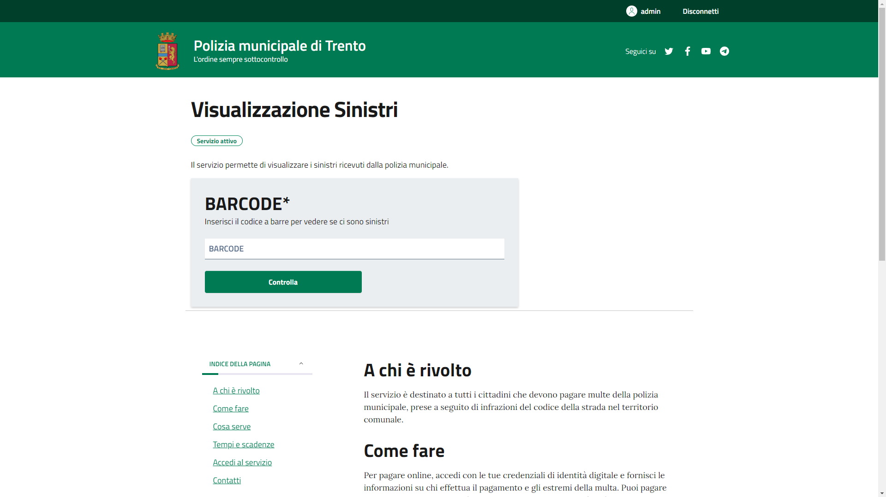

# Sito Polizia Municipale di Trento

## L'ordine sempre sottocontrollo


 _IF9MYSBzY3VvbGEgYXMgYWx3YXlzIHRyb3ZhIHVuIG1vZG8gcGVyIHNmcnV0dGFyY2lf_
 

## Descrizione 
Sito dove è possibile inserire sinistri di veicoli coinvolti in incidenti


## Funzionalità 
Possibilità di aggiungere patentati, veicoli, sinistri e anche visualizzare informazioni su di essi

## Utility
- **Repo Originale Github:** [Qui](https://github.com/italia/prototipo-pagamento-multe)


## Requisiti di sistema
- Un computer che abbia [Google Chrome](https://www.google.it/intl/it/chrome/next-steps.html?statcb=1&installdataindex=empty&defaultbrowser=0&brand=CHBD&ds_kid=43700059034491688&_gl=1*7aa71z*_up*MQ..&gclid=Cj0KCQiA2KitBhCIARIsAPPMEhLc5aW_Uj8n4JUkBPvZFHOxFmUORLaLtzJi05QPU52PUUjxltF9No8aAvp8EALw_wcB&gclsrc=aw.ds#), [Microsoft Edge](https://www.microsoft.com/it-it/edge/download?form=MA13FJ) o [Firefox](https://www.mozilla.org/it/firefox/download/thanks/)
- [XAMPP](https://www.apachefriends.org/it/)
- [VS Code](https://code.visualstudio.com/)
## Download e installazione

 Clonate la repository se volete avere il source code oppure andate a questo [link](https://www.therealfossi.altervista.org) per visitare il sito:

 ```shell
https://github.com/FA-05/RoadGuardian.git
```

> Sito [Polizia Municipale Trento](https://therealfossi.altervista.org/) &nbsp;&middot;&nbsp;
