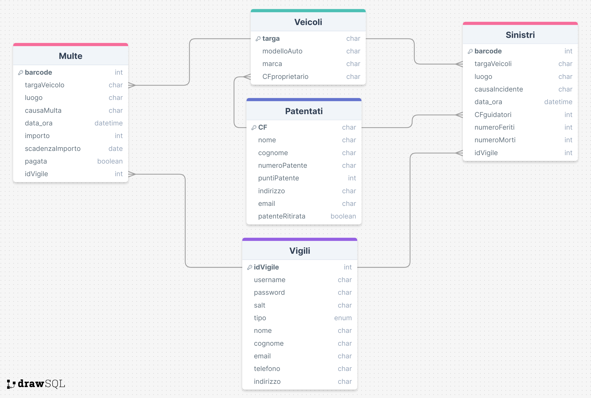

# RoadGuardian!
Visit the website: 🌐 https://roadg.altervista.org/ 🌐

## What is RoadGuardian:
RoadGuardian is my final year project at high school [ITT Buonarroti](https://www.buonarroti.tn.it/).
This platform allows police officers to issue fines or report accidents.
Each report is identified by a barcode, enabling people to easily access the report details.

## How to navigate through the website:
You can log in as an admin to view all the data:
Username: admin
Password: admin

## You can also log in as a police officer to issue fines or report accidents:
**Username**: Vigile4
**Password**: 123

Once a fine has been created, users can view its details by entering the barcode at the bottom of the homepage.

## Tech-Stack:
To build this web application, I used the following technologies:

**Front-end**: HTML, JavaScript, AJAX, jQuery, Tailwind CSS, and DaisyUI (for UI components).
**Back-end**: PHP, MySQL.

## Database Structure:

